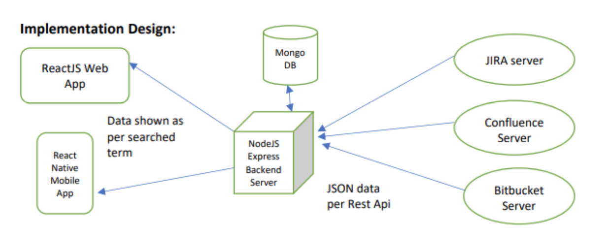

# AtlassianCentralizedKnowledgeBase
Atlassian Centralized Knowledge Base is MERN (MongoDb, Express, React, Node) stack based product which comes in both web(React) and mobile(React Native) variant.

This product provides in-house search engine for Atlassian server instances of JIRA, Confluence and Bitbucket systems and is based on the following architecture.

